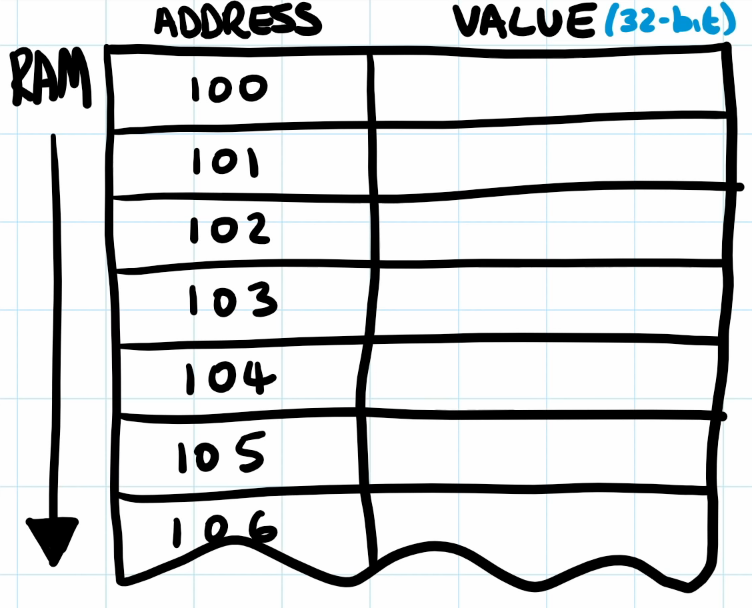

## Arrays and lists

### Initialization

Default initialization when doing `int arr[10];` is at each index, the value `0` is assigned. 
**NOTE**: however, later in the documentation, it seems to be stated that it could be whatever that is initialized at components that were left unassigned by the programmer, i.e. they could be anything.

#### Initialize without dims

It is also possible to create an array without specifying the dimensions of the array:

`int arr[] = { 10, 2, 30, 1 };`

Implicitly, an array `arr` with size `4` is created. 

#### One-dimensional

To initialize an array, the simplest way is to: 

`int arr[2];` will initialize the variable `arr` with two positions.

These can be assigned: `arr[0] = 10`, `arr[1] = 20`. 

To access them, one can use the corresponding indices:

```c++
arr[0] = 10; 
arr[1] = 20;
std::cout << arr[0];
> 10
```

#### Multi-dimensional

Multi dimensional arrays are also possible. Assume we want an array (matrix), which is 10 rows by 2 columns (in effect two vectors of 10 components):

```c++
double matrix[10][2];

// To access the data and save and extract:
matrix[5][0] = 10
std::cout << matrix[5][0];
```


## Classes

### Member functions

Is just like methods inside classes in python. For instance:

```c++
vector<int> matrix;
matrix.push_back(121); // push_back is a member function of the vector class
```

### Constructor functions

For instance when initializing a vector class, with size `10` and vals `100.0`, we call a constructor function (similar to `__init__` in python?). 

```c++
vector<int> matrix(3, 20); // the ...(3, 20) is feeding the constructor function with those parameters
```


## Compilation

### Windows

#### Command line

To compile cpp code from the command line, go to the vis studio folder, and open the `Developer Command Prompt for VS 2017`. Check that it works correctly by running `>>> cl` in the terminal.

To compile simple `.cpp` file:

```
>>> cl /EHsc hello.cpp
```


## Input output operations

### Input  for kattis

Seemingly, there is one general way of processing input (e.g. for kattis): 

```c++
long long a, b;
while (cin >> a >> b) {
   // solve test case and output answer
}
```

### Input and Output for kattis
```c++
int main(int argc, char const *argv[])
{
        /* long long is used to handle 64 bit integers */

        long long R1, S, OUT;
        while (cin >> R1 >> S) {
                // solve test case and output answer
                OUT = 2*S - R1;
                std::cout << OUT << endl;
        }
        return 0;
}
```

So seemingly, to output data for kattis, you are supposed to: ``std::cout << out << endl;`


### Incomplete knowledge

It is possible that the arrays that when the array is initialized, not all knowledge about it is there:
Thus we can do the following 

```c++
int incomp_at_init[20] = { 0, 10 };
```

### Memory management
When initializing an array of different types, then the compiler will assign a specific chunk of memory to the array. For each component, the array will be parking [type] sized chunk (e.g. for int being 4 bytes = 4 x 8 = 32 bits). 

### Array size

To get the size of a two dimensional array: 

```
int arr[][5] = {
				{0,2,3},
				{2,2,3}
			};
int rows = sizeof arr / sizeof arr[0]; // get 2 rows
int cols = sizeof arr[0] / sizeof(int); // 5 cols
```


### Errors

#### Array Bounds

If an array with pre-specified dimensions is accessed outside of those dimensions, it is not always that the compiler will discover that you are out of bounds with regard to the array. For instance:

```c++
int arr [2][2] = {{1,2},{3,4}};
std::cout << arr[1][2]; // second row, third column, which doesnt exist. . . 
>>> 358854752

```

In this case, when performing the above, we note the above value being returned. 


## Kernels

### General

* "Brain" of the operating system
* Defined as the "most important part of something"
* The **kernel** is a **computer** program at the core of a **computer's** operating system that has complete control over everything in the system
* kernel derived from cyrnel, (corn stem) analogously everything grows from this, the computer grows from the kernel. 
* it is the core


## Mathematical operations

### Summing


## Memory

### Handling

#### Stack


#### Heap


## Pointers

Assume the RAM to be illustrated as the figure below:



The RAM is filled with a number of adresses, where each adress will correspond to a 32-bit value. 

##### When declaring variables

Let us declare some variable `a` by:

```c
int a = 5;
```

Let's assume that the variable name `a` is declared at the memory address `102`, and the corresponding value to that address is `5`. Thus whenever we see the variable name `a` in our program, we mean to lookup in RAM the memory address `102`, which in returns the value `5`.

i.e.

```c
int a = 5; // will at some address, in this case 102, assign the 32-bit int value 5 to the address
		   // such that when `a` appears in our program, we will lookup RAM[102] which retruns the 
		   // 32-bit int value 5. 
```

To all intents and purposes, the variable name disappears: this is called ***direct addressing***, where we take a symbol (e.g. `a`) and it *directly corresponds to a location in RAM* (when we use `a` in our program, we mean to look at a specific location in RAM, to return the value stored there!). 

##### Introducing the pointer


In turn, a pointer is simply a symbol (variable name...) which holds a memory address. 

Let us construct a variable type called `pointer`, where when called the compiler will select a location in memory, and the value held will be a memory address:

```c
int a = 5;
pointer b = 100; // 100 is the memory address
```

In this case we tell the compiler that the symbol `b` corresponds to a pointer, which is a variable type holding memory addresses, and the value is `100` (i.e. `b` is a symbol which says to look at `RAM[104]`, which returns the value `100` which itself is a memory address. 

Normally, one does not manually type in location in memory for pointers. Instead, one uses the `&` (ampersand symbol) to tell the compiler to get the address of the given variable:

```c
int a = 5;
pointer b = &a; // this will store the address of `a` in the location of `b` in RAM
				// if we follow our illustrated examples in the figures
				// the value stored in `b` will be 102, because that is the address of `a`
				
```

##### Indirect addressing


Now that we have a variable symbol which stores an address, we would like a way to get that value. This is called indirect addressing. For this there is an operator that gets the value at the address: `*`

```c
int a = 5; 
pointer b = &a;
int c = *b; // we are telling the compiler get the value stored at the address 
			// stored in b

```

thus `int c = *b -> c = 5` because we are telling the compiler to use the address stored in `b`, which in turn is the address for the `a`. When we look at the address of `a` we get the 32-bit int value `5`. This value is then  stored in the address that `c` is directly addressing, in this case `100` (see the figure above).  

##### Summarizing the symbols

So we have introduced a number of symbols:

```c
// & 		-> get address of 
// * 		-> get value that the address points to 
// int* var -> var is containing an address. at that adress there is an int value
```

and also, note that there is no variable type called `pointer`. instead we reuse the asterix symbol (again) to indicate pointer type.  Because it being important that the programmer and the compiler knows the type of what the actual value we are pointing to is. It got a bit convoluted:

```c
int a = 5;
int* b = &a;
int c = *b;
```

so with `int* b` we are saying that at the address of `b`, we are storing an address (by virteu of the `*`) which in turn points to an `int`-value in memory.

##### why know type the ptr points to


There is a reason for the compiler to know what the type that an address points to is.

Assume that at each address  we have a 1-byte value (i.e. 8-bits). 

We know that in ``c or c++` program, an `int` will be a `32-bit ` value (4-bytes). Thus, when we do:

```c
int a = 5; 
```

the compiler will take up ***four*** locations in the RAM, because each memory address is 8-bits (1-byte), and 4 are required to store a 32-bit value. 

When we therefore do:

```c
int a = 5;
int* b = &a; // -> b = 100
```

so `b` will get the starting address of `a` and not where `a` also ends. 

If we (just because) incremented by  `b = b + 1`, then we get `b = 102`. This new memory address points to one quarter of the way through the addresses that `a` occupies. This can cause malfunction. Instead if we wish to increment, i.e. move on to the next thing in memory, we need to add the `sizeof` an `int` to `b` to get to the next location:

```c
b = b + sizeof(int) //
// -> 
b = b + 4 // in our current system, such that we jump to 104 (look in the figure)
```

##### an implementation

The following code is used:

```c
#include <iostream>
using namespace std;
int main()
{
	int SomeArray[10];	// each int is 32-bits = 4-bytes -> in total
						// 40 bytes will have been assigned in memory
						// which is continuous. 
	int *pLocation6 = &SomeArray[6];	// so we want the address of the 
										// 6th int element in the array
	int *pLocation0 = &SomeArray[0];
	
	/*Now we wish to print the difference between these two 
	memory addresses*/
	cout << "pLocation6 = " << (int)pLocation6 << endl;
	cout << "pLocation0 = " << (int)pLocation0 << endl;
	cout << "Difference = " << pLocation6 - pLocation0 << endl;

	cout << endl; system("Pause"); return 0;
}


```

the output is 

```
pLocation6 = 5504288
pLocation0 = 5504264
Difference = 6

Press any key to continue . . .
```

between index 6 and index 0, there are 6 elements, thus 6 addresses. We see that the difference between `5504288 - 5504264 = 24 `. However, when we take ask to print the difference, we get `6`. 

The location for the 6th element is ***24 bytes larger*** than for the 0th element. However, when the program is subtracting them ***as integer pointers*** we get the result in `int`. Because each `int` is 4-bytes, we get:
$$
\frac{24~bytes}{4\frac{bytes}{int}} = 6~int
$$

###### conclusion

The conclusion from the test is that the memory-addresses work on a per-byte space (i.e. 8-bit spaces, as we illustrated in the figures above). But the pointers work on a space defined by `int` for instance, which are 4-bytes large each. 

##### The pointer as a type

The pointer is a type. When we say `(int*)40` (i.e. that the value 40 is of type, aka typecast, to integer pointer type, it is counted in 4-byte hex). 

```c
for (int* i = 0; i < (int*)40; i++)
{
    cout << i << endl; 
}
```

In the above loop we are saying that the `i` is of type integer pointer. the loop breaks at the integer pointer value of 40. When we then print `i`, we see that `i+1 => i + 4 bytes`, as ***it is incrementing by 4***!

```c
00000000
00000004
00000008
0000000C
00000010
00000014
00000018
0000001C
00000020
00000024

Press any key to continue . . .
```


##### pnt and arrays

###### Iterating the addresses

```c
int SomeArray[10] = { 3, 6, 9, 12, 15, 18, 21, 24, 27, 30 };	

for(int i = 0; i<10; i++)
{
	cout << "address: " << SomeArray + i; // this will print each hex adress, with 4 byte spaces
	cout << " == " << *(SomeArray + i) << endl;
}

```

When declaring an array, the variable symbol, in this case `SomeArray` carries the starting address of the array. `i` will be interpreted as $i \implies4\times i$ when interacting with the pointer. Thus when we add the initial address to 


## Templates


## Typecasting

### Converting to new type, dynamically:

```c++
int a,b,c;
a = 10;
b = 20;
c = 30;

float d = (float)a + (float)b + (float)c
```


## Use C++17

### The command line operation

To be able to c++17, the following needs to be used in the command line: 

`g++ -std=c++1z [file].cpp -o [out file].out`


## Vectors

Vectors are more versatile and address some of the annoying features of c++ arrays. Note that the c++ Vector object is not a mathematical vector. It is much like arrays still (e.g. in terms of accessing the data). 

### Importing Vectors

Is not part natively, but needs to be `#include` vectors:

```c++
#include <vector>
```

### Declaring vectors

#### One-dimensional

```c++
#include <vector>
int main(){
    vector<int> vector_obj_name;
    vevtor<int> other_vector(4); // vector of size 4
    return 0;
}
```

So to declare a vector, one uses the template name `vector`, followed by the type of the object, in this case `int`.

#### Multi-dimensional

```c++
int n = 3; 
int m = 4; 
vector<vector<int>> vec(n, vector<int> (m, 121)); // n rows, m columns
>>
121 121 121 121 
121 121 121 121 
121 121 121 121 
```

1. We want a type `vector` containing type `vector` of `int`. 
2. For the constructor: 
   1. we are saying that the initial dimension is `n`. 
   2. for the second parameter: we are saying that we want to fill the vector at each component with `vector<int>` with the shape `m`, at each component of the new vector equalling `121`


### Appending data to vectors

```c++
vector<int> matrix;
matrix.push_back(121);
cout << matrix[0] << endl;

>>> 121
```

### Initializing with spec val

Say that we would like to initialize a vector with a specific value, such as 10, so all elements in the vector had the integer 10:

```c++
vector<int> matrix(5, 10); // creates a vector size 5, all with values 10
vector<float> matrix2(10, 100.0); // creates a vector of size 10, with float vals 100.0
```


### Resizing

There is a `.resize(newdim, init_val)` member function that can be used. if the new dimension is bigger than the current vector, than it will fill the empty components with `0`. If it is smaller, it will pop the last items of the vector.  Note that `init_val` if provided, will replace the empty components with that value. 


