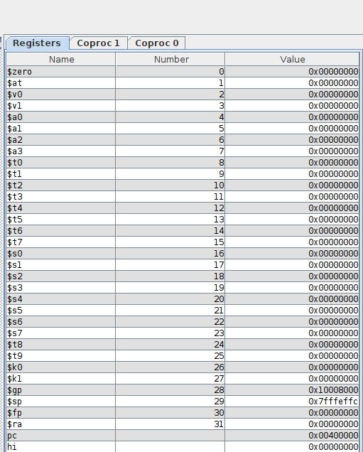
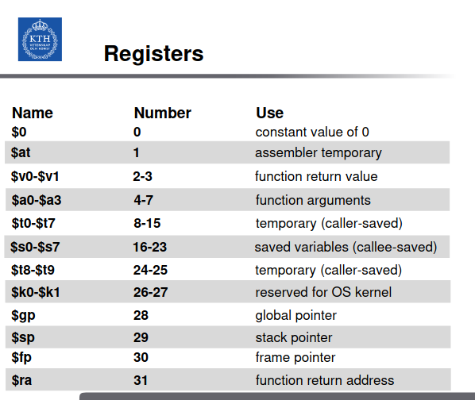

# Getting started

## The MARS simulator

MARS is an assembler simulator, is an IDE for the MIPS assembly language. 

### Download and run

Download the MARS simulator from the Missouri state uni page. It will ship a `.java` file. Run the file by `>>> java -jar MARS.jar`

### Writing and assembling code

For a basic for loop in MIPS assembler:

`./basic_loop.asm`

```assembly

main:
	addi $t0, $0, 0  # i = 0
	addi $t1, $0, 10 # upper limit = 10
	addi $s1, $0, 0  # sum = 0
	j loop

loop: 
	slt $t2, $t0, $t1
	beq $t2, 0, done
	addi $t0, $t0, 1
	addi $s1, $s1, 1
	j loop

done:  
	lui $t3, 0x1001
	sw $s1 0($t3)

	
```


#### The functions?

Alright, there is a bunch of stuff happening in the assembly program. First, we note the different names, e.g. `main:`, `loop:`, `done:`. 

These are keywords that simplifies things for us. When the code is being assembled, these keywords just helps us organize the binaries, they themselves DO NOT get stored somehow. 

***So the assembler will line by line go through the code***, remembering the keywords. It is only when you want to ***jump*** to the keyword, that they become relevant.

Because the assembler is intent on going through line after line, in some cases we want to direct this line after line reading. 


#### Using registers

Alright, the CPU ships with fast-access memory, called registers. These can be accessed and used in assembly. In MIPS, it is possible to refer to and call these fast-access register locations. For instance ` $s0` is a register (semi-permanent?) that aint temporary, whatever that means.  Each register has a specific address. That address refers to a sequence of bits, which is recognized by the cpu.  Below is a list with a bunch of registers that we can use in the code. 







#### Instructions

There are alot of operands (instructions), which refer to different parts of the CPU functional capabilities (that are in turn produced by a bunch of logic gates, in turn constructed by a bunch of transistors). 

##### `addi`

The `addi` is the "add immediate" operand, that takes three parameters:

`addi $s0, $0, 1` will in the register `$s0` save the added result from the register referring to zero, `$0`, and the decimal value $1$. 

Thus if we look at the *address* which exists in the `$s0` location, we will find the result, from the "add immediate" function. 


#### `slt`

Is the "set less than" operand, that will set the first parameter to the val $1$ if the $p_1 < p_2$. This will allow us to create for loops, in a fairly trivial manner


#### `beq`

is the "branch if equal" operand, that will jump to the provided label. This allows us to perform the if-else statement that is a part of the for-loop logic.


### Addresses

Aight, interacting with the RAM is one of the more interesting and fun parts of working with assembler. 


#### Constants value

Say we would like to provide the register with a 32-bit value, which refers to an address. Because in MIPS assembly code, we cannot immediately assign a 32-bit value. instead we need to first use the `lui` load upper immediate instruction, which will "add immediate" the most significant 16-bits, to the immediate value, and sets the lower to $0$


```assembly
# Say we would like to store the value 0x1001000
# which refers to a specific location in RAM memory
# because in hex this is a 32-bit value, we cannot 
# immediately addi, add immediate, this value and store
# it in the register. Instead we need to use lui,
# which will addi the given value to the 16 most significant
# bits of the register value:

lui $s0, 0x1001
# at the $s0 address, we will have:
# 0x10010000
# note that the last 4 hex-positions
# are just zeros. Despite us providing 
# a value which corresponds to 0x1001,
# lui will add a 4 of zeros (16 bits worth of zeros)
# in the end of the value producing 0x10010000
```

If we want a 32-bit value, we after `lui` will use `ori`. Say we want to store `0x10010200`:

```assembly
lui $s0, 0x1001
ori $s0, $s0, 0x0200
```

